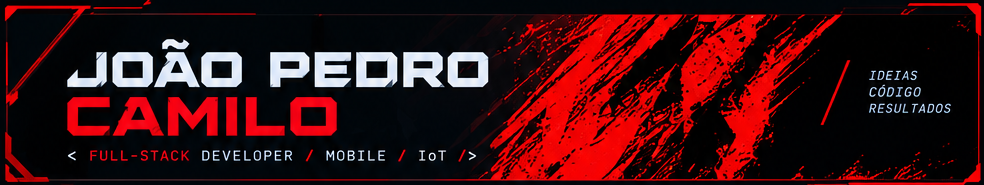

 

<table>
<tr>

<td width="35%" valign="top">

<h2>👤 SOBRE MIM</h2>

<h3>João Pedro Pereira Camilo</h3>

🎓 <strong>Análise e Desenvolvimento de Sistemas — FIAP</strong>

💼 Experiência anterior na área administrativa com
<strong>ERP TOTVS</strong>, atualmente em transição para tecnologia.

🚀 <strong>Foco em:</strong>

<ul>
<li>Full-Stack Development</li>
<li>Desenvolvimento Mobile</li>
<li>Internet das Coisas</li>
<li>APIs</li>
<li>Integração Hardware + Software</li>
</ul>

💡 Gosto de transformar ideias em aplicações funcionais
e projetos que conectam diferentes tecnologias.

<h3>📍 LOCALIZAÇÃO</h3>

<strong>São Paulo (SP), Brasil 🇧🇷</strong>

<h3>🎯 OBJETIVO</h3>

Transformar ideias em aplicações funcionais, unindo
<strong>desenvolvimento de software, tecnologia e criatividade</strong>.

<h3>📫 CONTATO</h3>

</td>

<td width="65%" valign="top">

<h2>⚡ QUEM SOU EU?</h2>

Sou estudante de <strong>Análise e Desenvolvimento de Sistemas na FIAP</strong>
e desenvolvedor em formação, com foco em construir aplicações modernas
e entender todo o processo por trás de um produto digital.

Minha experiência profissional anterior na área administrativa me
proporcionou contato com <strong>processos, sistemas ERP e rotinas empresariais</strong>,
experiência que hoje levo para o desenvolvimento de software.

Tenho explorado principalmente o ecossistema
<strong>Full-Stack</strong>, desenvolvimento <strong>Mobile</strong>
e projetos de <strong>IoT</strong>, buscando conectar software,
APIs e hardware em soluções reais.

Atualmente estou focado em evoluir minhas habilidades técnicas,
construir projetos e conquistar minha primeira oportunidade
profissional na área de tecnologia.

 

<blockquote>
<strong>
Código não precisa começar perfeito. 
Precisa começar.
</strong>
</blockquote>

<h2>🛠️ MINHAS SKILLS</h2>

<h3>Linguagens</h3>

  

<h3>Frameworks & Ferramentas</h3>

  

  

</td>

</tr>
</table>

<h2>💻 PROJETOS</h2>

<table>
<tr>

<td width="50%" valign="top">

<h3>🐾 ClyvoPaws Mobile</h3>

Aplicativo mobile voltado ao <strong>universo pet</strong>,
desenvolvido para explorar soluções mobile e integração
com outros componentes do projeto.

<strong>Tecnologias</strong>

<code>TypeScript</code>
<code>React Native</code>

</td>

<td width="50%" valign="top">

<h3>📡 Coleira de Atividade Clyvo</h3>

Projeto de <strong>Internet das Coisas</strong>, utilizando
hardware integrado a software para monitoramento de atividades.

<strong>Tecnologias</strong>

<code>C++</code>
<code>IoT</code>
<code>Hardware</code>

</td>

</tr>

<tr>

<td width="50%" valign="top">

<h3>👑 KingsMarket</h3>

Back-end focado em gestão e desenvolvimento
de aplicações empresariais.

<strong>Tecnologias</strong>

<code>Java 17</code>
<code>Spring Boot</code>

</td>

<td width="50%" valign="top">

<h3>💻 Site Pessoal</h3>

Repositório com projetos, estudos e trabalhos desenvolvidos
durante minha formação.

<strong>Tecnologias</strong>

<code>HTML</code>
<code>CSS</code>
<code>JavaScript</code>

</td>

</tr>
</table>

<h2>📊 GITHUB</h2>

 

<h2>🐍 CONTRIBUTION SNAKE</h2>

<h2>🚀 CURRENT FOCUS</h2>

<table>
<tr>

<td align="center" width="25%">

<h3><code>01</code></h3>

<strong>FULL-STACK</strong>

Construção de APIs e aplicações completas.

</td>

<td align="center" width="25%">

<h3><code>02</code></h3>

<strong>MOBILE</strong>

Desenvolvimento de aplicações com React Native.

</td>

<td align="center" width="25%">

<h3><code>03</code></h3>

<strong>IoT</strong>

Integração entre hardware, software e APIs.

</td>

<td align="center" width="25%">

<h3><code>04</code></h3>

<strong>EVOLUTION</strong>

Aprendizado contínuo através de projetos.

</td>

</tr>
</table>

<h2>
<code>BUILD • LEARN • CREATE</code>
</h2>

<strong>Desenvolvendo projetos.</strong> 
<strong>Aprendendo todos os dias.</strong> 
<strong>Evoluindo um commit por vez.</strong>

 

<code>━━━━━━━━━━━━━━━━━━━━━━━━━━━━━━━━━━━━━━━━</code>

